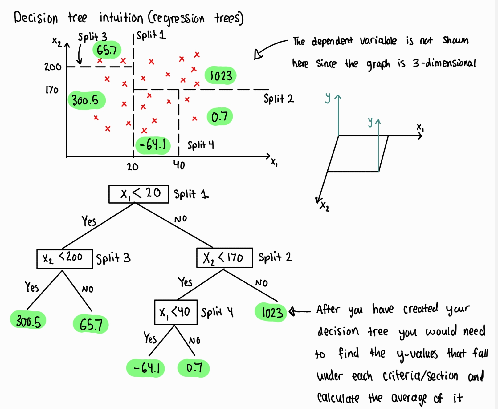

# fincrime project: online payment fraud detection

I am going through this tutorial ([link here](https://www.geeksforgeeks.org/online-payment-fraud-detection-using-machine-learning-in-python/)) which uses machine learning (ML) to detect fraud in online payments. I will be using this tutorial to learn about supervised machine learning and the specific types such as classification and regression. Additionally, the online payment fraud detection tutorial will also teach me about creating training and testing datasets during the ML model training process.

| Machine Learning Algorithm  | Overview |
| ------------- | ------------- |
| [Logistic Regression](https://github.com/hsarfraz/fincrime-online-payment-fraud-detection-/blob/main/logistic%20regression.md)  | supervised learning algorithm used for classification  | 
| [XGBoost (eXtreme Gradient Boosting)](https://github.com/hsarfraz/fincrime-online-payment-fraud-detection-/blob/main/XGBoost%20(eXtreme%20gradient%20boosting).md)  | supervised learning algorithm used for classification & regression  |
| [SVM (Support Vector Machines)](https://github.com/hsarfraz/fincrime-online-payment-fraud-detection-/blob/main/SVM%20(Support%20Vector%20Machines).md)  | supervised learning algorithm used for classification & regression  |
| [Random Forest Classifier](https://github.com/hsarfraz/fincrime-online-payment-fraud-detection-/blob/main/Random%20Forest%20Classifier.md)  | supervised learning algorithm used for classification & regression  |

## Random Forest Classifier (supervised learning algorithm used for classification & regression)

There are two types of random forest classification. One is random forest regression and the other is random forest classification. Random forests (both regression and classification) are a version of **ensemble learning**. Ensemble learning is when you take multiple algorithms, or multiple copies of the same algorithm, to make a model that is much more powerful.

### Random Forest Regression 

This is a random forest that is applied to regression trees. [Youtube video link which explains the concept further](https://www.youtube.com/watch?v=X1MRbEnEq2s&t=1s)

**Step 1**: Pick random k-data points from the training set. "pick k-data points" means that we do a random sampling of the data points to contruct each decision tree

How are regression decision trees made? [Video reference](https://www.youtube.com/watch?v=_wZ1Lo7bhGg)

* To make the decision tree the scatter plot would be split into segments
* In the graph below, the dependant variable is not shown since the graph is 3-dimensional. It is important to note that the initial graph does seem familier with the way the SVM graph was set up but the key difference is that in SVM's the dependent variable is represented through grouping of the different data points.
* The algorithm decides were to split the data and does this through information entropy (the measure of the uncertainty or randomness associated with a random variable)

**Step 2**: Build the decision tree associated to these K data points. 

**Step 3**: Choose the number of trees you want to build and repeat steps 1 and 2

**Step 4**: Once all of your decision trees are created you can now start to predict the values of new data points. Each decision tree will make it's own prediction for that specific data point and once you have all the predictions made from all the decision trees, you can then calculate the average of all predicted outputs produced by all the decision trees. This final average is the final prediction value of the random forest regression.

