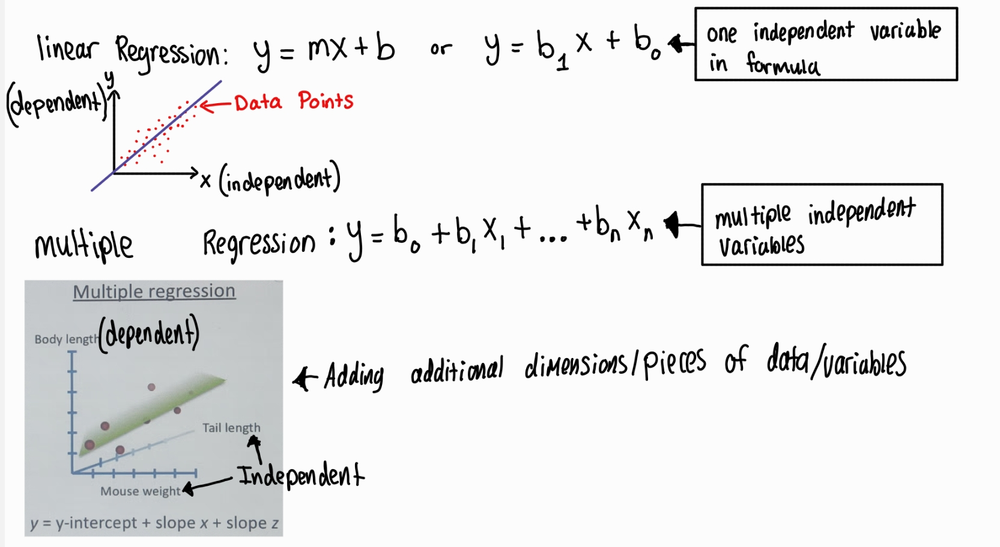
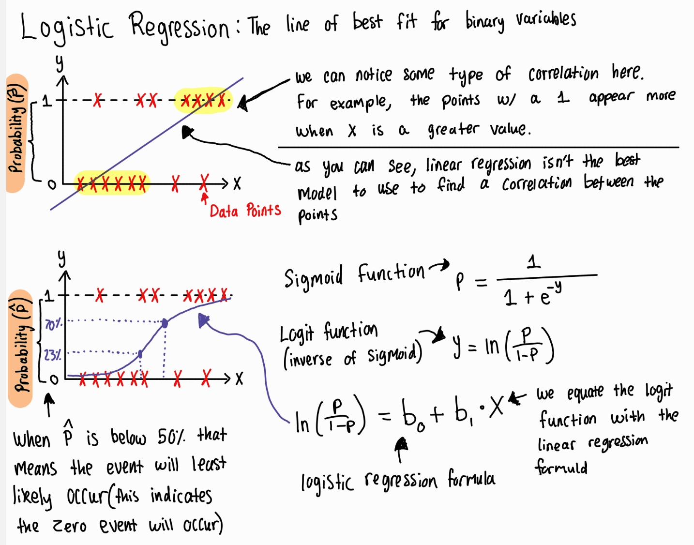

# fincrime project: online payment fraud detection

I am going through this tutorial ([link here](https://www.geeksforgeeks.org/online-payment-fraud-detection-using-machine-learning-in-python/)) which uses machine learning (ML) to detect fraud in online payments. I will be using this tutorial to learn about supervised machine learning and the specific types such as classification and regression. Additionally, the online payment fraud detection tutorial will also teach me about creating training and testing datasets during the ML model training process.

## Logistic Regression (supervised learning algorithm used for classification) 

<ins> Overview of linear & multiple regression </ins> -note: regression can be used for supervised learning

link: [multiple regression image reference](https://www.youtube.com/watch?v=zITIFTsivN8)

<ins> Logistic Regression </ins>

Logistic regression is a statistical method used for predicting a binary (yes/no) outcome based on one or more independent variables. In the context of machine learning, this would be a supervised learning algorithm used for classification. Specifically, predicting the probability of a binary outcome

link: Youtube video "[Logistic Regression Simply Explained with Examples](https://www.youtube.com/watch?v=CuvIc8C3EDI)"

Here is the math calculations to get from the sigmoid to logit function

