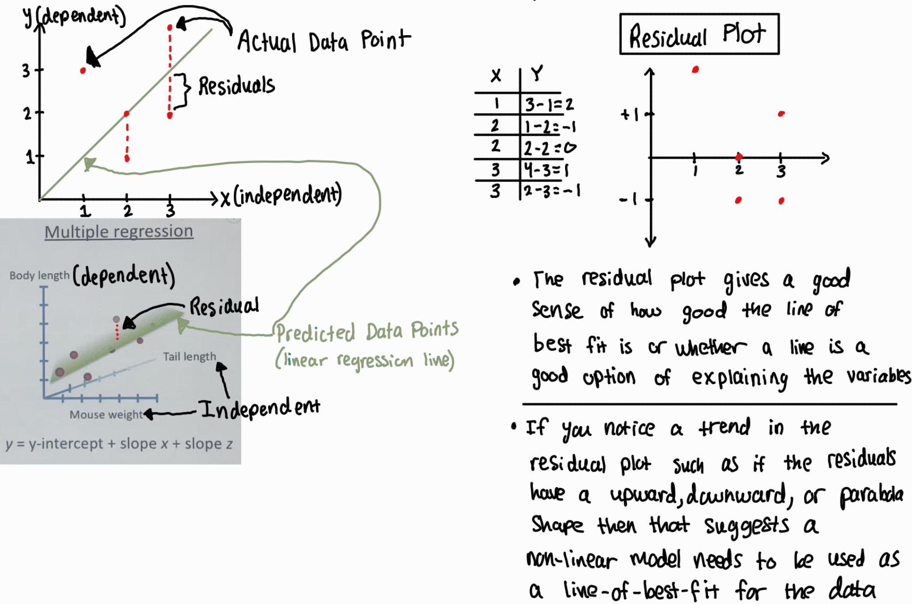

# fincrime project: online payment fraud detection

I am going through this tutorial ([link here](https://www.geeksforgeeks.org/online-payment-fraud-detection-using-machine-learning-in-python/)) which uses machine learning (ML) to detect fraud in online payments. I will be using this tutorial to learn about supervised machine learning and the specific types such as classification and regression. Additionally, the online payment fraud detection tutorial will also teach me about creating training and testing datasets during the ML model training process.

| Machine Learning Algorithm  | Overview |
| ------------- | ------------- |
| [Logistic Regression](https://github.com/hsarfraz/fincrime-online-payment-fraud-detection-/blob/main/logistic%20regression.md)  | supervised learning algorithm used for classification  | 
| XGBoost (eXtreme Gradient Boosting)  | supervised learning algorithm used for classification & regression  |

## XGBoost (eXtreme Gradient Boosting) (supervised learning algorithm used for classification & regression)

A machine learning algorithm that gradually increases its accuracy through training. Gradient boosting is applied on top of another machine learning algorithm. It involves two types of models ([link to source from Google which talks about XGBoost in greater detail](https://developers.google.com/machine-learning/decision-forests/intro-to-gbdt))

* a weak ML model which is typically a decision tree
* s strong ML model which composes of multiple weak models

<ins> What is a residual? </ins>

The residual is the difference between the actual data points and predicted values (actual - predicted = residual). The predicted values are the data points on the regression line (line of best fit)

<ins> XGBoost (eXtreme Gradient Boosting) process  </ins>

* The prediction function line for the original dataset is usually calculated by just finding the average of the y-values. Or you can just pick any other value for your prediction.
* Residual graph level 1 is the first residual graph that represents the residuals calculated from the original dataset. Additionally, the red lines represent decision boundaries created by the decision tree to split the residuals (errors) for better prediction
* In residual graph level 1, similarity scores ($S_{root}$, $S_{left}$, $S_{right}$) are calculated. Similarity scores help determine the best place to split the residuals 

* 
Update 2: I would also like to point out that in my previous explanation below the "line of best fit/regression line" is actually supposed to be called the "prediction function". The concept of the "line of best fit/regression line" is a term related with linear regression whereas the prediction line in XGBoost is different. Although the two can be conceptually similar 

For anyone reading this comment in the future the answer to my first question is yes. The numbers shown in the decision tree is the average of the residuals calculated from the previous residual plot. The average of the residuals would then be used as a new prediction function line for the part of the graph that is split (the new graph). Additionally, the data points (of the new graph) will be the residuals calculated from the previous graph through subtracting the previous graphs data points with the previous line of best fit. 

So after you have plotted the data points of the new graph and have calculated the average number of residuals (which will be used as the new prediction function line), you calculate the residuals of those points with respect to the new prediction function lines (as shown in min 9:16). Remember, the number for the new prediction function lines come from the decision trees which showed the average regressions of the previous graph. When you initially start this process using the original dataset (as shown in 0:21) you usually get the average by just averaging all the y-values. 

https://www.youtube.com/watch?v=QWEI0JjiDBg

https://www.youtube.com/watch?v=PxgVFp5a0E4

tutorials

https://www.youtube.com/watch?v=XXHhrlL-FWc

https://blog.cambridgespark.com/getting-started-with-xgboost-3ba1488bb7d4

