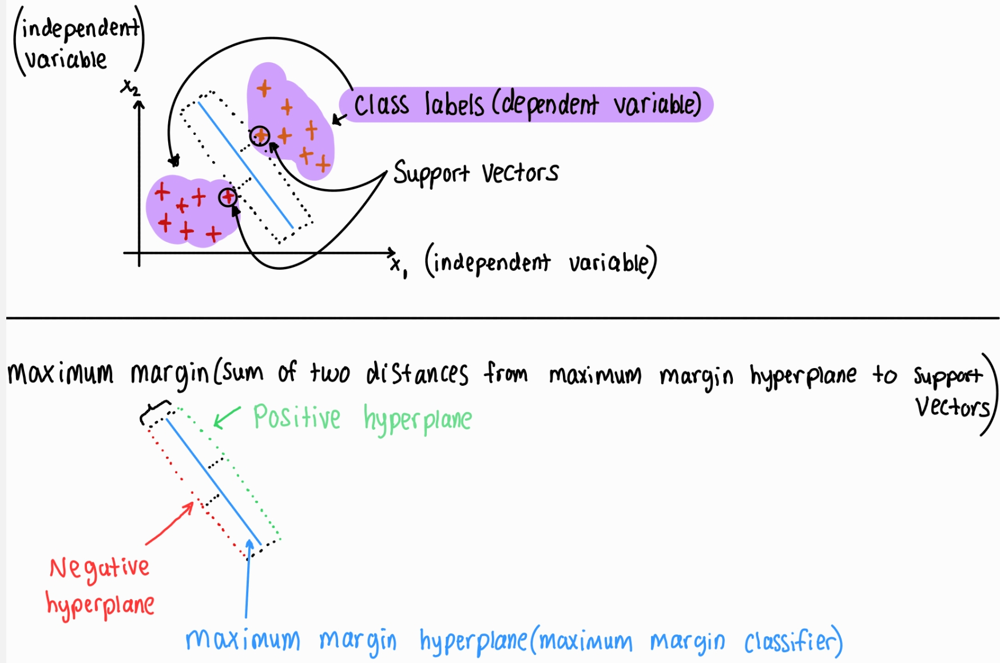

## SVM (Support Vector Machines) (supervised learning algorithm used for classification & regression)

A machine learning algorithm that helps us find the best decision boundary to split our space into classes.[Here is a video which talks about support vector machines in greater detail](https://www.youtube.com/watch?v=O0lQVaxLyv4&list=PLulEtxNA34XSV4kZzulnKMFenJB-TnGrt) 

* SVM are mainly used for categorization tasks.
* The support vectors (in the graph below) are called support vectors since they support the decision boundary. In other words, the support vectors support the way the algorithm is being built
* The independent variables (in the graph below) are columns from our dataset. The dependent variable is another column that is selected from our dataset but it is represented through the labels/groupings that the data points/vectors are grouped into
* The maximum margin is the sum of the two distances from the maximum margin hyperplane to the support vectors

 
