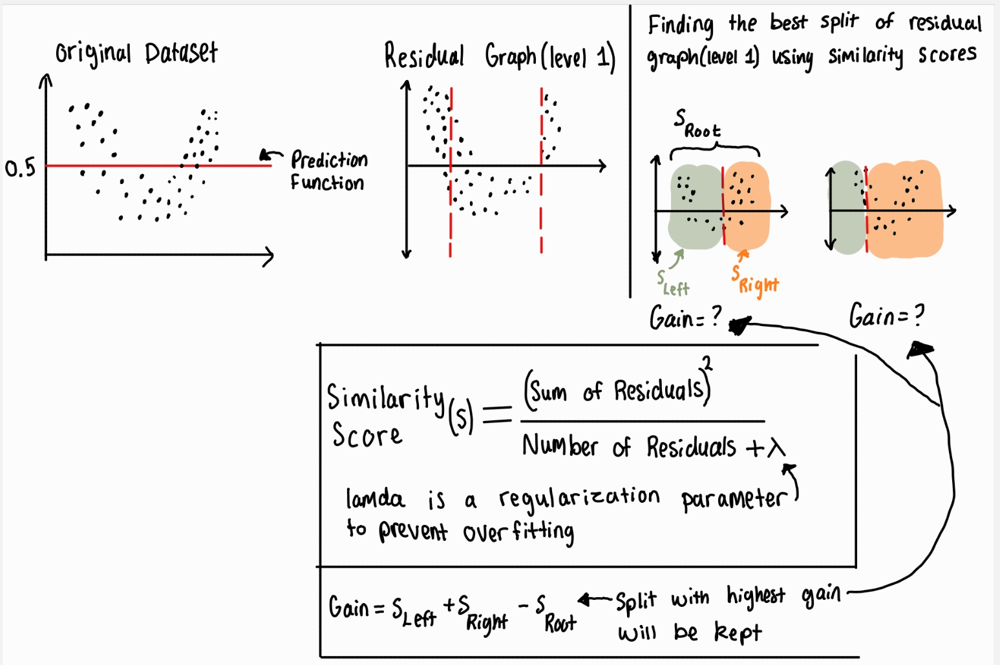

## XGBoost (eXtreme Gradient Boosting) (supervised learning algorithm used for classification & regression)

A machine learning algorithm that gradually increases its accuracy through training. Gradient boosting is applied on top of another machine learning algorithm. It involves two types of models ([link to source from Google which talks about XGBoost in greater detail](https://developers.google.com/machine-learning/decision-forests/intro-to-gbdt))

* a weak ML model which is typically a decision tree
* s strong ML model which composes of multiple weak models

<ins> What is a residual? </ins>

The residual is the difference between the actual data points and predicted values (actual - predicted = residual). The predicted values are the data points on the regression line (line of best fit)

<ins> XGBoost (eXtreme Gradient Boosting) process  </ins>

1. The prediction function line for the original dataset is usually calculated by just finding the average of the y-values. Or you can just pick any other value for your prediction. [video reference link](https://www.youtube.com/watch?v=1Apk4lGg008)
2. Residual graph level 1 is the first residual graph that represents the residuals calculated from the original dataset. Additionally, the red lines represent decision boundaries created by the decision tree to split the residuals (errors) for better prediction. [video reference link](https://www.youtube.com/watch?v=QWEI0JjiDBg)
3. In residual graph level 1, similarity scores ($S_{root}$, $S_{left}$, $S_{right}$) are calculated to determine the best place to split the residuals. Once the three similarity scores are calculated the gain is calculated. The split that has the highest gain value is the graph which has the best split.
4. Once the residuals are split, the average of the residuals is calculated and this value is then added in the decision tree. There might be sections where the similarity score needs to be calculated again to further split that subsection of residuals that have already been split previously
5. The prediction function/score is then calculated [video reference link](https://www.youtube.com/watch?v=PxgVFp5a0E4)
6. Once the new prediction function/score is calculated then it is re-applied on the original dataset and the whole process repeats 

tutorials

https://www.youtube.com/watch?v=XXHhrlL-FWc

https://blog.cambridgespark.com/getting-started-with-xgboost-3ba1488bb7d4
