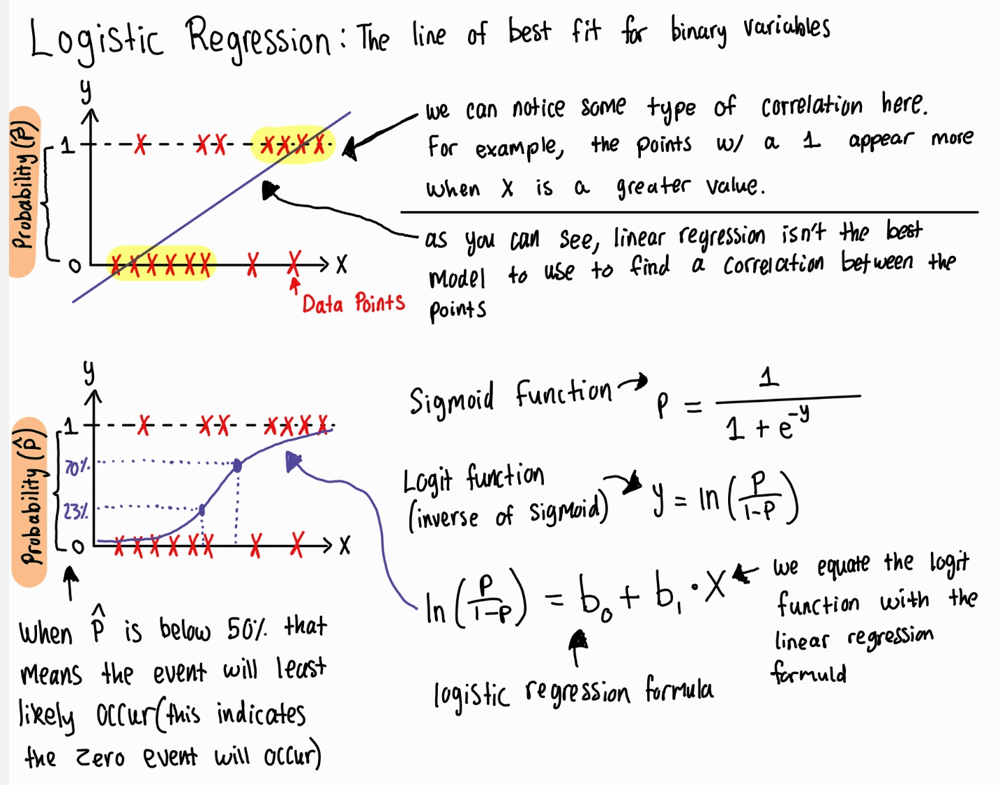

## Logistic Regression (supervised learning algorithm used for classification) 

<ins> Overview of linear & multiple regression </ins> -note: regression can be used for supervised learning

link: [multiple regression image reference](https://www.youtube.com/watch?v=zITIFTsivN8)

<ins> Logistic Regression </ins>

Logistic regression is a statistical method used for predicting a binary (yes/no) outcome based on one or more independent variables. In the context of machine learning, this would be a supervised learning algorithm used for classification. Specifically, predicting the probability of a binary outcome. Youtube video link "[Logistic Regression Simply Explained with Examples](https://www.youtube.com/watch?v=CuvIc8C3EDI)"

Here is the math calculations to get from the sigmoid to logit function

Here is the math calculation that solve for P in the logistic regression formula

Here is a graph of logistic regression on desmos

